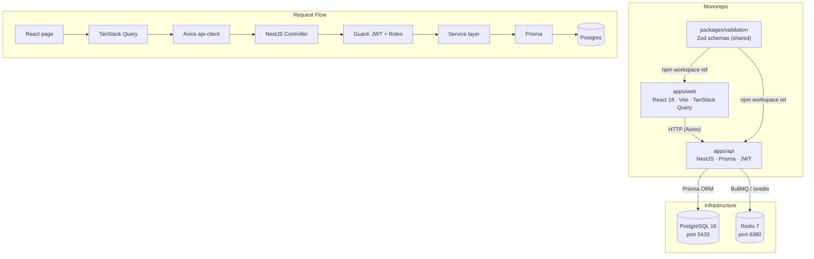
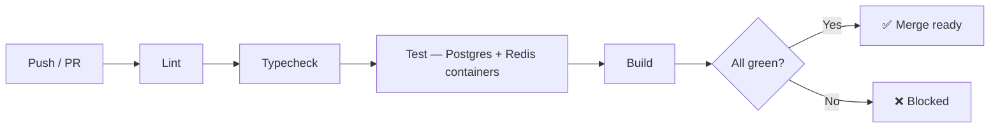

<div align="center">


<a href="#">
  
</a>

<br/><br/>

[](https://github.com/meet-adraja/assetflow/actions/workflows/ci.yml)


<br/>

<i>A full-stack monorepo for organizations that need to track physical assets — equipment, vehicles, furniture, shared spaces — across registration, allocation, bookings, maintenance, and audit.</i>

<br/><br/>

**Engineered by [Meet Adraja](<your-github-url>)**

</div>

---

## 📖 Table of Contents

<table>
<tr>
<td valign="top" width="33%">

- [Why AssetFlow](#-why-assetflow)
- [Architecture](#-architecture)
- [Tech Stack](#-tech-stack)
- [Features](#-features)
- [Quick Start](#-quick-start)

</td>
<td valign="top" width="33%">

- [Demo Accounts](#-demo-accounts)
- [Environment Variables](#-environment-variables)
- [API Overview](#-api-overview)
- [Testing](#-testing)

</td>
<td valign="top" width="33%">

- [Project Structure](#-project-structure)
- [Roadmap](#-known-gaps--roadmap)
- [Contributing](#-contributing)
- [License](#-license)
- [Author](#-author)

</td>
</tr>
</table>

---

## 🧠 Why AssetFlow

> These are the engineering decisions that make this more than a CRUD app — correctness is enforced where races actually happen: **the database.**

<details open>
<summary><b>🔒 DB-level booking overlap prevention</b></summary>
<br/>

Overlap checks are **not** done in application code — check-then-insert has a race window. Instead, a PostgreSQL `EXCLUDE USING gist` constraint on `(assetId, tsrange(startTime, endTime, '[)'))` rejects the second of two concurrent overlapping inserts **atomically**. `BookingsService.create` inserts and catches error code `23P01`, translating it to a structured `409`. Back-to-back slots (`09:00–10:00`, `10:00–11:00`) succeed because the range is half-open `[)`.

📂 [`apps/api/src/modules/bookings/bookings.service.ts`](apps/api/src/modules/bookings/bookings.service.ts) · [`apps/api/prisma/manual-migrations/001_booking_exclude_and_sequence.sql`](apps/api/prisma/manual-migrations/001_booking_exclude_and_sequence.sql)

</details>

<details>
<summary><b>🧮 Optimistic-locking <code>AssetStateService</code> as the single writer for <code>asset.status</code></b></summary>
<br/>

Every status transition in the system — allocation, return, maintenance approval, resolution, audit closure cascade — goes through one service. It validates the move against `ASSET_STATUS_TRANSITIONS`, then does `UPDATE ... WHERE id = $id AND version = $version` and checks the affected row count. If a concurrent transition already incremented the version, the update matches zero rows and the caller gets a `409 ASSET_VERSION_CONFLICT` rather than a silent overwrite.

📂 [`apps/api/src/modules/assets/asset-state.service.ts`](apps/api/src/modules/assets/asset-state.service.ts)

</details>

<details>
<summary><b>🔐 Row-locked double-allocation prevention</b></summary>
<br/>

`AllocationsService.allocate` opens a transaction and executes `SELECT ... FOR UPDATE` on the asset row before checking its status. A concurrent second request for the same asset blocks on the row lock, then re-reads the already-allocated status and receives a structured `409` with `currentHolder` and `transfer_request_available: true`.

📂 [`apps/api/src/modules/allocations/allocations.service.ts`](apps/api/src/modules/allocations/allocations.service.ts)

</details>

<details>
<summary><b>🛡️ Role re-validated from the DB on every request — not from the JWT payload</b></summary>
<br/>

`JwtStrategy.validate` fetches the live user row from Postgres on every authenticated request. A token minted before a demotion or deactivation carries no residual privilege for the rest of its lifetime.

📂 [`apps/api/src/modules/auth/jwt.strategy.ts`](apps/api/src/modules/auth/jwt.strategy.ts)

</details>

<details>
<summary><b>🚫 Signup cannot escalate role</b></summary>
<br/>

`signupSchema` (Zod) has no `role` field. A client-injected `role: "admin"` is stripped before it reaches `AuthService.signup`, which always writes `role: "employee"`. The only promotion path is `EmployeesService.promote`, gated behind `@Roles("admin")`.

📂 [`packages/validation/src/auth.ts`](packages/validation/src/auth.ts) · [`apps/api/src/modules/auth/auth.service.ts`](apps/api/src/modules/auth/auth.service.ts)

</details>

<details>
<summary><b>🔁 Audit cycle closure cascades asset status</b></summary>
<br/>

`AuditsService.closeCycle` iterates findings inside a single transaction, taking `SELECT ... FOR UPDATE` on each discrepant asset and pushing it through `AssetStateService`: `missing → lost`, `damaged → under_maintenance`. If the transition is illegal for the asset's current state (e.g. already `disposed`), the error is swallowed per-asset so the rest of the closure succeeds.

📂 [`apps/api/src/modules/audits/audits.service.ts`](apps/api/src/modules/audits/audits.service.ts)

</details>

---

## 🏗 Architecture



---

## 🧰 Tech Stack

<div align="center">


</div>

| Layer | Technology | Why |
|---|---|---|
| Frontend | React 18, TypeScript | Component model, strict typing |
| Routing | React Router v6 | Client-side SPA routing |
| Data fetching | TanStack Query v5 | Server-state cache, background refetch |
| Styling | Tailwind CSS | Utility-first, no runtime overhead |
| Charts | Recharts | Composable bar/heat charts for reports |
| Build | Vite 5 | Sub-second HMR in dev |
| Backend | NestJS 10, TypeScript | Module system, DI, decorators |
| ORM | Prisma 5 | Type-safe queries, migration history |
| Database | PostgreSQL 16 | EXCLUDE constraints, row locks, sequences |
| Cache / Queue | Redis 7, BullMQ | Queue infrastructure (processor not yet wired) |
| Auth | Passport-JWT, bcrypt | Separate access/refresh token pair |
| Validation | Zod (shared package) | Single schema used by both backend DTO and frontend form |
| Monorepo | npm workspaces | Zero-config, no extra tooling |
| CI | GitHub Actions | Postgres + Redis service containers, lint → typecheck → test → build |

---

## ✨ Features

<details>
<summary><b>🔑 Auth</b></summary>
<br/>

- Email/password signup (always creates `employee` role — no client-side escalation possible)
- JWT access token (15 min) + refresh token (7 days) with separate signing secrets
- Password reset via token (forgot-password flow)

</details>

<details>
<summary><b>📊 Dashboard</b></summary>
<br/>

- KPI cards: assets available, allocated, maintenance today, active bookings, pending transfers, upcoming/overdue returns
- Quick-action shortcuts: Register Asset, Book Resource, Raise Maintenance Request

</details>

<details>
<summary><b>🏢 Organization Setup</b></summary>
<br/>

- Create and manage departments; assign a department head
- Create asset categories with arbitrary `customFields` schema (e.g. `{ warrantyMonths: "number", vendor: "string" }`)

</details>

<details>
<summary><b>📦 Asset Registry</b></summary>
<br/>

- Register assets with tag auto-generated from a Postgres sequence (`AF-0001`, `AF-0002`, …)
- Fields: name, category, serial number, condition, location, bookable flag, custom field values
- Full asset history log (every status change, actor, timestamp)

</details>

<details>
<summary><b>🔄 Allocation & Transfer</b></summary>
<br/>

- Allocate an asset to a user or department; row-locked to prevent double-allocation
- Return with condition note; overdue allocation list
- Transfer request workflow: `requested → approved/rejected → re-allocated` inside one transaction

</details>

<details>
<summary><b>📅 Resource Booking</b></summary>
<br/>

- Book any `isBookable` asset for a time slot; overlap prevented by DB `EXCLUDE` constraint
- Reschedule and cancel; per-asset calendar view

</details>

<details>
<summary><b>🔧 Maintenance</b></summary>
<br/>

- Raise a maintenance request; approval required before asset moves to `under_maintenance`
- Assign technician; start work; resolve — each step transitions asset status through `AssetStateService`

</details>

<details>
<summary><b>🕵️ Asset Audit</b></summary>
<br/>

- Create audit cycles scoped by department or location; assign auditors
- Record findings per asset: `verified`, `missing`, `damaged`
- Close cycle: cascades `missing → lost`, `damaged → under_maintenance`; generates discrepancy report

</details>

<details>
<summary><b>📈 Reports & Analytics</b></summary>
<br/>

- Asset utilization by category (bar chart + CSV export)
- Maintenance frequency report
- Assets due for attention (overdue return or scheduled maintenance)
- Department allocation summary
- Booking heatmap by day-of-week

</details>

<details>
<summary><b>🔔 Notifications</b></summary>
<br/>

- In-app notifications for: asset assigned, transfer requested/actioned, maintenance update, audit assignment
- Mark as read; unread-only filter

</details>

---

## 🚀 Quick Start

**Prerequisites:**  

```bash
# 1. Install all workspace dependencies
npm install

# 2. Copy the example env file
cp apps/api/.env.example apps/api/.env

# 3. Start Postgres (port 5433) and Redis (port 6380)
docker compose up -d

# 4. Generate the Prisma client
npm run prisma:generate

# 5. Run the baseline migration
npm run prisma:migrate -- dev --name init

# 6. Apply the manual EXCLUDE constraint + asset_tag sequence
#    (Prisma's DSL cannot express EXCLUDE constraints or raw sequences)
docker exec assetflow-postgres-1 psql -U assetflow -d assetflow \
  -c "CREATE SEQUENCE IF NOT EXISTS asset_tag_seq START WITH 1 INCREMENT BY 1;"

# 7. Seed demo data
npm run prisma:seed

# 8. Start the API (http://localhost:4000)
npm run dev:api

# 9. Start the web app (http://localhost:5173)
npm run dev:web
```

> ⚠️ **Note on the EXCLUDE constraint:** `prisma/manual-migrations/001_booking_exclude_and_sequence.sql` contains the full DDL. The `docker exec` step above covers the sequence; apply the EXCLUDE block separately if your Postgres version requires an `IMMUTABLE` wrapper function (see the file for details).

---

## 🔑 Demo Accounts

<div align="center">

All seeded accounts share the password **`Password123`**

| Email | Role |
|---|---|
| `admin@assetflow.dev` | 🛠️ `admin` |
| `manager@assetflow.dev` | 📋 `asset_manager` |
| `depthead@assetflow.dev` | 🏢 `department_head` (Engineering) |
| `employee@assetflow.dev` | 👤 `employee` (Sales) |

</div>

---

## ⚙️ Environment Variables

File: `apps/api/.env`

| Variable | Default | Purpose |
|---|---|---|
| `DATABASE_URL` | — | Postgres connection string |
| `REDIS_URL` | — | Redis connection string |
| `JWT_ACCESS_SECRET` | — | Signing secret for access tokens |
| `JWT_REFRESH_SECRET` | — | Signing secret for refresh tokens |
| `JWT_ACCESS_TTL` | `15m` | Access token lifetime |
| `JWT_REFRESH_TTL` | `7d` | Refresh token lifetime |
| `PORT` | `4000` | API listen port |
| `CORS_ORIGIN` | `http://localhost:5173` | Allowed frontend origin(s) |

---

## 🔌 API Overview

All routes are prefixed `/api/v1`. Authentication is JWT Bearer on every route except `POST /auth/signup` and `POST /auth/login`.

<details open>
<summary><b>View full route table</b></summary>
<br/>

| Route group | Description |
|---|---|
| `POST /auth/signup`, `POST /auth/login`, `POST /auth/refresh` | Registration, login, token refresh |
| `GET /auth/me`, `POST /auth/logout` | Current user, session termination |
| `POST /auth/forgot-password`, `POST /auth/reset-password` | Password reset flow |
| `GET/POST/PATCH/DELETE /departments` | Department CRUD; assign head |
| `GET/POST/PATCH /asset-categories` | Category CRUD with custom field schema |
| `GET /employees`, `PATCH /employees/promote`, `PATCH /employees/status` | List users; role promotion (admin only); activate/deactivate |
| `GET/POST/PATCH /assets`, `GET /assets/:id/history` | Asset registry; full change history per asset |
| `POST /allocations`, `POST /allocations/return`, `GET /allocations/overdue` | Allocate, return, list overdue |
| `GET/POST/PATCH /transfer-requests` | Raise, list pending, approve/reject transfers |
| `POST /bookings`, `PATCH /bookings/reschedule`, `PATCH /bookings/:id/cancel` | Create, reschedule, cancel bookings |
| `GET /bookings/calendar/:assetId` | Time-slot calendar for a bookable asset |
| `POST/PATCH /maintenance-requests` | Raise, approve, assign, start, resolve |
| `GET/POST/PATCH /audit-cycles`, `GET /audit-cycles/:id/discrepancy-report` | Full audit lifecycle |
| `GET /reports/utilization`, `/maintenance-frequency`, `/due-for-attention`, `/department-summary`, `/booking-heatmap` | Aggregated reports |
| `GET /reports/export/utilization.csv` | CSV export |
| `GET /notifications`, `PATCH /notifications/:id/read` | In-app notification inbox |
| `GET /activity-logs` | Org-wide activity feed (admin/manager) |
| `GET /dashboard/kpis`, `GET /dashboard/my-allocations` | Dashboard aggregates |

</details>

---

## 🧪 Testing

Tests in `apps/api/test/` run against a **real Postgres instance** — the properties under test (row locks, exclusion constraints) don't exist in mocks.

| File | What it covers |
|---|---|
| `concurrent-allocation.spec.ts` | Two simultaneous `allocate()` calls on the same asset; asserts exactly one succeeds and the other returns a structured `409 ASSET_ALREADY_ALLOCATED` |
| `concurrent-booking.spec.ts` | Two overlapping `create()` booking calls; asserts the DB constraint rejects the second with `BOOKING_OVERLAP`; a separate test asserts adjacent non-overlapping slots both succeed |
| `rbac.e2e.spec.ts` | Full HTTP round-trips via Supertest: employee gets `403` on an admin route; signup strips an injected `role: "admin"`; department head gets `403` approving a transfer outside their department |

```bash
# Requires a running Postgres with migrations applied
npm run test
```

CI runs all three suites automatically on push and PR against real Postgres and Redis service containers (see [`.github/workflows/ci.yml`](.github/workflows/ci.yml)).



---

## 📂 Project Structure

```
assetflow/
├── apps/
│   ├── api/                  # NestJS backend
│   │   ├── prisma/           # Schema, migrations, seed, init SQL
│   │   ├── src/
│   │   │   ├── common/       # Guards, decorators, filters, exceptions
│   │   │   └── modules/      # One module per domain (14 modules)
│   │   └── test/             # Integration + e2e specs
│   └── web/                  # React frontend
│       └── src/
│           ├── components/   # UI primitives + AppLayout
│           ├── lib/          # Axios client, auth context, React Query setup
│           └── pages/        # One page component per screen (11 pages)
└── packages/
    └── validation/           # Shared Zod schemas
        └── src/
            ├── auth.ts       # Signup, login, password reset
            ├── assets.ts     # Register, update, search
            ├── org.ts        # Departments, categories, employees
            └── operations.ts # Allocations, bookings, maintenance, audits
```

---

## 🗺️ Known Gaps / Roadmap

Honest gaps, not items cut for polish — the natural next steps for anyone extending this codebase:

- [ ] **BullMQ processor not yet wired.** BullMQ and ioredis are installed and the Redis connection is live, but no queue producer or consumer is registered. Booking reminders and overdue-return push notifications are currently computed on-demand (dashboard KPIs, `/allocations/overdue`) rather than delivered by a scheduled job. Adding a `BullModule` registration and a cron-style processor is the cleanest next step.
- [ ] **No file/photo upload UI.** The API accepts asset photo URLs as strings; a real upload flow requires object storage (S3, GCS) and a presigned-URL endpoint, which is out of scope for the current implementation.
- [ ] **Custom fields are backend-only.** Asset categories support an arbitrary `customFields` schema (stored and validated in Postgres). The frontend does not yet render these as dynamic form fields — values are stored correctly, but the registration form doesn't expose them.
- [ ] **Transfer inbox has no pagination.** `GET /transfer-requests/pending` returns all pending transfers. For large organizations this needs cursor- or offset-based pagination.
- [ ] **No Swagger UI mounted in production.** `@nestjs/swagger` is installed; decorating controllers and mounting `SwaggerModule` would surface interactive API docs at `/api/docs`.

---

## 🤝 Contributing

1. Fork the repo and create a branch (`git checkout -b feat/my-change`)
2. Make your changes; ensure `npm run lint` and `npm run typecheck` pass
3. Add or update tests in `apps/api/test/` if the change touches a concurrency rule or RBAC path
4. Open a pull request against `main` — CI will run lint, typecheck, tests, and build automatically

---

## 📄 License

MIT — see [LICENSE](LICENSE). *(A `LICENSE` file is not yet present in the repo; one should be added.)*

---

## 👤 Author

<div align="center">

Built by **[Meet Adraja](<your-github-url>)**

[](<your-github-url>)
[](<your-linkedin-url>)

</div>

---

<div align="center">

### ⭐ If you find this useful, consider starring the repo


</div>
